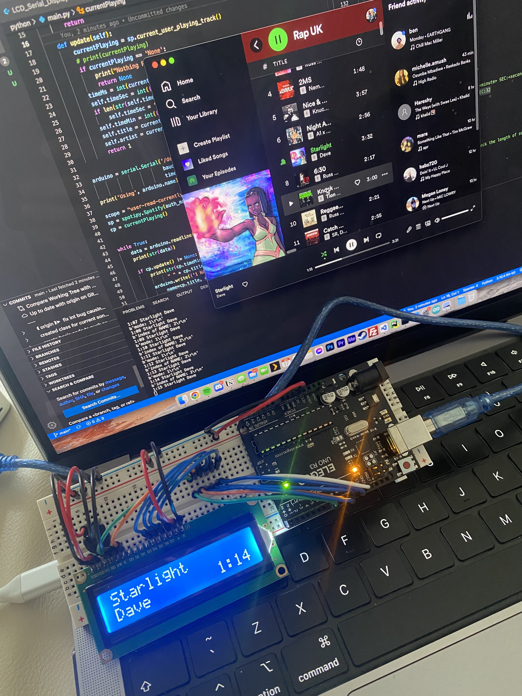
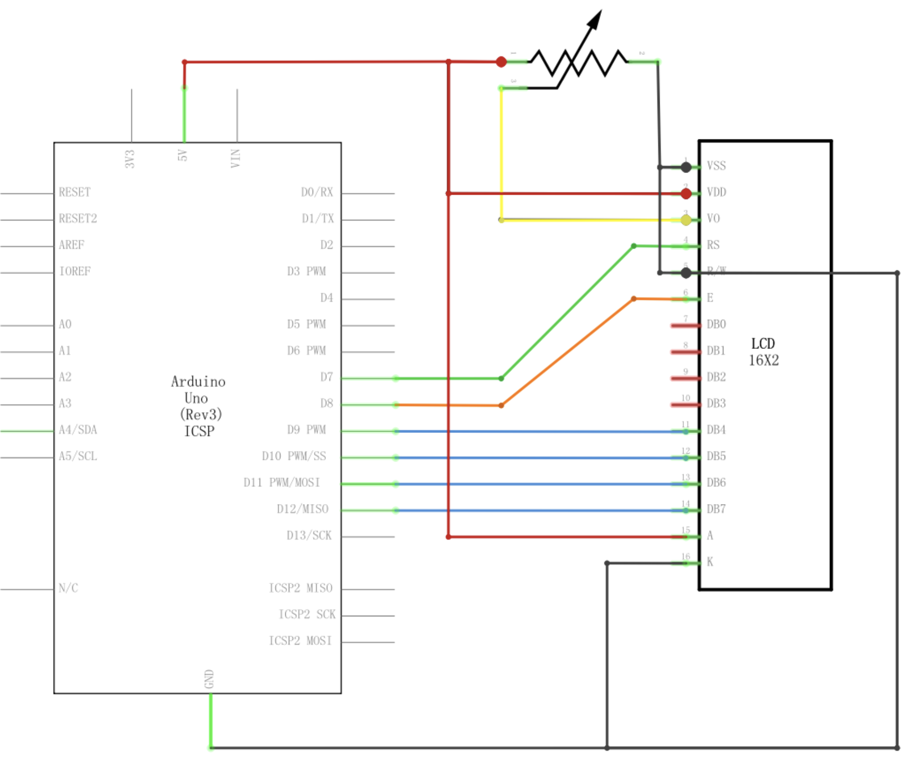

# SongInfoArdunioLCD

## Description

Use Python and an Arduino Uno R3 to leverage the Spotify API in order to create a real-time display on a LCD. It displays the current track, artist and elapsed time when Spotify is playing else it displays the current time & date.

## Setup

To use this code and try it on your own Arduino, you will need an LCD display that uses the LiquidCrystal library.

1. Clone the repo
   `git clone https://github.com/amirldn/SongInfoArdunioLCD.git`
2. Set up your Arduino and display with a breadboard - taken from Elegoo.co.uk
   
3. Open Arduino IDE and import the LiquidCrystal library if you have not already and then upload the sketch to your device
4. Install spotipy & pyserial via pip
5. Create a project on the [Spotify Developer Dashboard](https://developer.spotify.com/dashboard/login) and note your client_secret and client_id.
6. Set your callback url on the Dashboard to http://localhost/
7. Run the following in your terminal
   `export SPOTIPY_CLIENT_ID='your-spotify-client-id'`
   `export SPOTIPY_CLIENT_SECRET='your-spotify-client-secret'`
   `export SPOTIPY_REDIRECT_URI='http://localhost/' `
8. Run the code and you should be taken to a Spotify Auth page, click Ok and copy & paste the link you are redirected to into your terminal when prompted
9. You should now be all setup!
